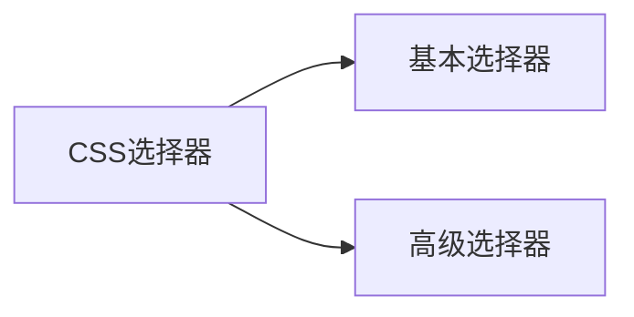

# 1. webstorm的安装

> https://www.jetbrains.com/webstorm

见视频

---

# 2. 编写网页的神器(emmnet表达式)

~~~shell
+: 同级
>:下一级
~~~

---

# 3. css

css: 层叠样式表,级联样式表

---

# 4. CSS的引入方式

## 4.1 内联方式引入样式

~~~css
<span style="color:red; font-size: 120px">我是中国人</span>
~~~

优点: 使用简单

缺点: 属性要是太多不方便修改,没有做到内容与样式相分离

> 这种方式只适合在测试环境写少量的样式

---

## 4.2 内部方式引入样式

~~~css
<style>
    span {
        color: red;
        font-size: 30px;
    }
</style>
~~~

优点: 把当前页面多有的css可以写在一块了

缺点: 没有实现完全的 `内容与样式相分离`

> 只是适合在测试环境使用

---

## 4.3 外部方式引入样式

```css
<!--使用link引入外部css;   需要添加rel属性-->
<link href="./base.css"  rel="stylesheet">
```

优点: 内容与样式彻底分离,可以按需引入

> 可以在生产环境直接使用

---

# 5. CSS中的颜色的写法

- 常用的颜色可以写英文
- 16进制的颜色值的写法
- RGB颜色值的写法
- RGBA的写法(带透明度的写法);  最后一个值是透明度  0-1,之间的小数;

---

# 6. CSS中的选择器的分类



---

# 7. CSS基本的选择器

## ID选择器

~~~css
#id值{
    属性名称:属性值;
    ....
}
~~~

## Class选择器

~~~css
.类名{
   属性名称:属性值;
    ....
}
~~~

## 标签选择器

~~~scss
.标签名称{
   属性名称:属性值;
    ....
}
~~~

---

# 8. CSS的高级选择器

## 分组选择器

~~~shell
选择器1,选择器2,...{
	CSS属性名称:属性值;
	...
}
~~~

## 子类选择器

~~~css
父选择器>子选择器{
	CSS属性名称:属性值;
	...
}
~~~

## 后代选择器

~~~css
父选择器 后代选择器{
	CSS属性名称:属性值;
	...
}
~~~

## 兄弟选择器

~~~css
#d1~li{
    color: red;
}
~~~

兄弟选择器选择的是从当前元素**后面**的`所有兄弟`

## 相邻兄弟选择器

~~~css
#d1+li{
    color: red;
}
~~~

相邻兄弟选择器选择的是从当前元素**后面**的`第一个兄弟`

## 过滤选择器

```
h1.box2{
    color: red;
}
```

ps: h1与.box2中间没有`空格`的

## 属性选择器

~~~css
/*包含name属性的选择器*/   
input[name]{
    background-color: #ccc;
}
~~~

~~~css
/*选择属性name='age'的input*/
input[name='age']{
    background-color: #ccc;
}
~~~

## 通配符选择器(了解)

~~~css
/*选择所有元素*/
*{
    
}
~~~

## 伪类选择器

~~~css
/*鼠标划过的效果*/
a:hover{
    color: pink;
}
~~~

## 伪元素(对象)选择器

~~~css
.box::before {
    content: "前面加的内容";
}
~~~

~~~css
.box::after{
    content: "后面加的内容";
}
~~~

## CCS3中新增的选择器

~~~css
/*第一个子元素*/
ul > li:first-child {
    color: red;
}
~~~

```css
/*最后一个子元素*/
ul>li:last-child{
    color: red;
}
```

~~~css
/*选择第二个子元素*/
ul>li:nth-child(2){
    color: #f00;
}
~~~

~~~css
/*选择偶数行*/
ul>li:nth-child(2n){
    color: #f00;
}
~~~

~~~css
/*选择奇数行*/
ul>li:nth-child(2n+1){
    color: #f00;
}
~~~

~~~css
/*nth-of-type可以忽略中断结构的元素*/
ul>li:nth-of-type(2){
    color: red;
}
~~~

---

# 9. css选择器的优先级

- CSS后面的样式覆盖前面的样式(相同权重下)
- id选择器>class选择器>标签选择器

---

# 10. CSS的宽高属性

~~~css
width: 200px;
height: 200px;
~~~

---

# 11. 前端开发调试神器(google开发者工具箱)

~~~shell
f12
ctrl+shift+i
右键--->检查
~~~

---

# 12. 字体属性

```css
span {
    font-size: 18px; /*字体大小*/
    color: red; /*字体颜色*/
    font-family: "PingFang SC", Arial, "Microsoft YaHei", sans-serif; /*字体的家族*/
    font-style: italic; /*字体样式  italic:斜体*/
    font-weight: bolder; /*bolder:粗体  lighter:细体 ,还可以是具体的 磅数 */
}
```

---

# 13. 列表属性

~~~css
ul{
    /*去除列表前面的原点或者数字*/
    list-style: none;
}
~~~

---

# 14. (链接)文本属性

~~~css
text-decoration-color: red; /*线条颜色*/
text-decoration-line: line-through; /*线条类别  line-through:穿过文本的线*/
text-decoration-style: dashed; /*solid:默认(实线) dashed:虚线 */
~~~

~~~css
text-decoration: none; /*去掉下面的线*/
~~~

---

# 15. 背景属性

~~~css
width: 100px;
height: 100px;
/*background-color: pink; !*背景颜色*!*/
/*background-image: url("./images/mm.jpg");*/
/*background-repeat: no-repeat; !*背景图片的平铺方式 默认是平铺的*!*/
/*background-size: 400px 200px; !*写一个值:代表的是宽度,此时的高度自动根据宽度的比例伸缩;写两个值就是固定的背景图片大小*!*/
background-image: url("./images/xbt.jpg");
background-repeat: no-repeat;
/*background-size: 10px 10px;*/
background-size: cover;
background-position: 71px 68px; /*背景的偏移量*/
~~~

----

# 16. 行高属性

~~~css
width: 400px;
height: 100px;
background: pink;
line-height:100px;  /*行高等于父元素的高度,则字体在竖直方向居中*/
~~~

---

## 17. 文本的对齐方式

~~~css
h1 {
    text-align: center;  /*元素中的文本("我要学习Java大数据")相对元素("h1")的对齐方式*/
}
~~~

---

# 18. 盒子模型

在html中,所有的元素都是一个盒子;

## 18.1 边框属性

```css
border-bottom: 2px solid green;
border-top: 20px solid green;
border-left: 2px solid green;  /*简写*/
/*border-color: red; !*边框颜色*!*/
/*border-width: 20px;  !*边框宽度*!*/
/*border-style: solid;  !*边框样式*!*/
/*border: 10px solid red;*/  /*简写*/
```

