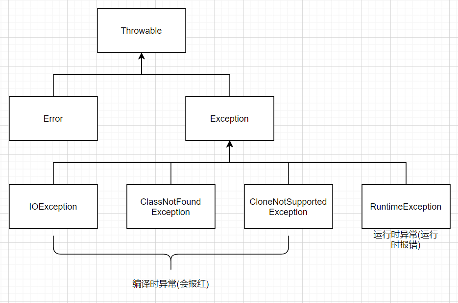
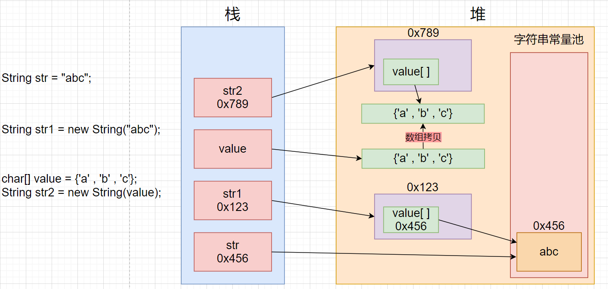
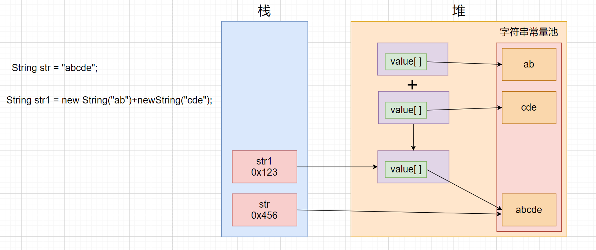
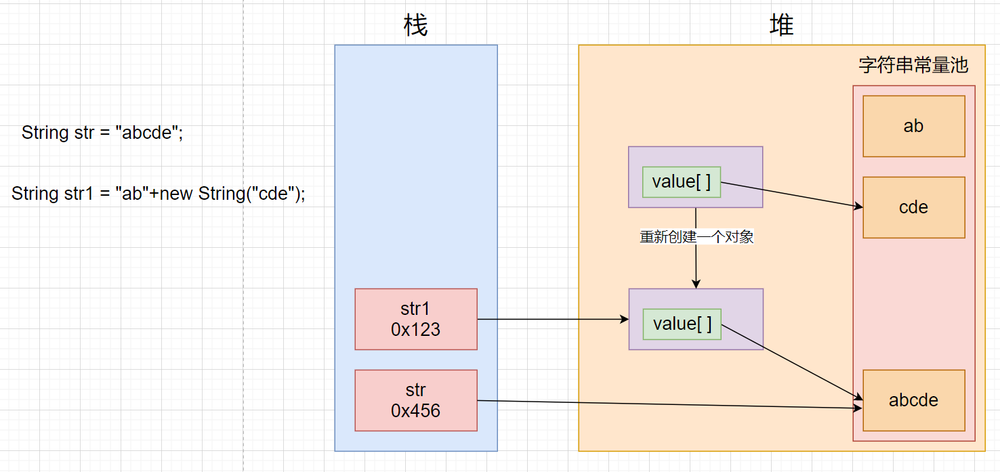

[TOC]

jps 查看进程号

jmap 内存泄漏情况

#### 1.类和对象

##### 1.字段

字段:类里面,方法外定义的变量,就做字段,成员变量,成员属性

实例成员变量:

```java
public String name;
```

静态成员变量

```java
public static int age;
```

person是一个Person类型引用

```java
Person person = new Person();
System.out.println(person);
```

原因:

如果使用println()就会调用String类中的valueOf()


Object类中的toString()


* toString()方法会在println的时候自动被调用

* 将对象转换成字符串这样的操作叫做**序列化**
* toString是Object类提供的方法,我们自己创建的Person类默认继承自Object类,可以重写toString方法

---

**类名遵循大驼峰原则**

**Person person=null;//引用类型可以赋值null**

**person属于局部变量**

**局部变量在栈上**

**对象在堆上,成员变量也就在堆上**

---

##### 2.访问方式

实例成员变量:通过对象的引用来进行访问

静态成员变量:通过类名访问,也可以通过对象的引用来进行访问,会有警告,合法但不合理,不建议使用

---

##### 3.静态变量和方法

static修饰,**不属于对象**,不在对象里边

1. 静态的方法和成员变量不依赖对象
2. 只有一份,存在于方法区

可以通过对象引用,但是,通常经过类名.静态成员变量

在静态方法内,不能调用非静态方法

**非静态方法是要对象引用来访问**

非静态方法内,可以调用静态方法

**静态方法不需要依赖对象,类存在,静态方法就存在**

```java
Person person = null;
person.静态方法();	//也是正确的
```

原因:在编译的时候JVM发现调用静态方法的对象为null值后，自动将null值的对象替换为了类名调用。

静态方法中是不允许定义静态属性的,因为用static修饰的变量属于全局变量,而定义在方法中的变量作用于只能是方法中,所以相互矛盾,Java是不允许的

**普通的成员方法内,不能定义静态的成员变量**

**为什么main方法是静态的:**

main函数是被系统调用的,如果不是静态的,系统无法进来执行main函数

---

##### 4.初始化方式

1. 就地初始化
2. 默认初始化
3. 实例化后再进行初始化

**局部变量要先初始化,再使用**

**常量在堆还是栈..,和是不是被final修饰没关系,final只是不能被修改**

**和是不是成员变量或者是局部变量有关系**

```java
public final int SIZE;	//表示只能初始化一次,可以有多份
public static final int COUNT;	//表示只有一份,只能初始化一次
```

---

##### 5.类与对象内存的存储


***

**面向对象的语言有一些特征:继承,封装,多态,组合**

**一定要注意:不要写成Java的三大特征**

**不能说是Java,因为C++也是面向对象的语言**

**不能说三大特征,组合也算是特征**

OOP语言:面向对象

OOP语言:Java,C++

***

##### 6.封装

封装:使用private关键字修饰成员变量

外部不可访问被封装的成员变量,只能在当前类中直接使用,类外可通过setName(),getName()等公有接口进行访问和修改

**意义:降低类的调用者学习的成本,更好的管理代码,提高开发效率**,避免对属性直接进行操作

成员属性一般都设置为私有的

---

##### 7.重载

重载的要求:

1. 方法名相同
2. 参数列表不同
3. 返回值不做要求
4. 在同一类中

**构造方法也可以进行重载,构造方法的互相调用,调用语句需要写在第一行**

---

##### 8.构造方法

没有返回值,且方法名与类名相同

当没有在类中没有写任何构造方法时,编译器会自动生成一个不带参数的构造方法

如果写了其他构造方法,就不会生成不带参数的构造方法

作用:可以用来初始化对象的属性值

---

 实例化一个对象/创建一个对象分几步?

1. 为对象分配内存
2. 调用合适的构造方法

**调用完构造方法后,对象才真正存在**

**构造方法中this不代表当前对象,因为此时对象还未产生,此时this代表当前对象的引用**

---

##### 9.代码块

###### 1.本地代码块

定义在方法中

```java
public void method() {
    
    {
        System.out.prtinln("本地代码块");
    }
}
```

######  2.实例代码块(构造代码块)

```java
public Student() {
    System.out.prtinln("构造代码块");
}
```

###### 3.静态代码块

不依赖于对象

```java
static{
    this.age=8888;❌
        System.out.prtinln("静态代码块");
}
```

###### 4.执行顺序

1. 父类: 静态代码块,只执行一次

2. 子类:静态代码块,只执行一次

如果多个静态的属性,方法和代码块,执行顺序为定义的先后顺序

3. 父类:	1. 实例代码块	2. 构造方法

4. 子类:	1. 实例代码块	2. 构造方法

***

匿名对象:

```java
new Student();
method(new Student());//每次调用方法都要创建一个对象
```

优点:只使用一次

缺点:每次使用都要new对象

匿名数组:

```java
method(new int[]{1,2,3,4,5});
```

可变参数编程:

```java
public static int method(int... a) {
    for(int i=0;i<a.length;i++) {
    }
}
```

---

#### 2.面向对象编程

* 包
* 继承
* 组合
* 多态
* 抽象类
* 接口

##### 1.包

**包(package)是组织类的一种方式**

是一组类的集合

包能防止类的名字的冲突

**使用包的主要目的是保证类的唯一性**

1. `import java.util.Arrays ;`
   `package java.util;`//导入包中的**类**
   `import java.util.*;`//导入包下的所有类  *通配符
2. 导入的是包下的类,而不是包

**虽然导入了包底下的所有的类,但是并不是会将所有的类进行加载**

**一般情况是,用到哪个类,才会加载哪个类**

2. 

```java
import java.util.*;
import java.sql.*;
public class Test{
    public static void main(String[] args){
        Date date=new Date();
    }
}
```

**报错,因为util包和sql包都有Data类,调用时会发生冲突**

解决方法:

1. 删除用不到的包

2. ```java
   java.util.Date date=new java.util.Date();
   //直接标明用的是哪个包下的类
   ```

---

###### 1.静态导入

一般情况不会使用

使用`import static`可以导入包中的静态的方法和字段

```java
import static java.lang.System.*;
public class Test{
    public static void main(String[] args) {
        out.println("hello");
    }
}
```

但是可以方便的写一些代码

```java
import static java.lang.Math.*;
public class Test{
    public static void main(String[] args) {
        double x=30;
        double y=40;
        //double result=Math.sqrt(Math.pow(x,2)+Math'.pow(y,2));
        double result=sqrt(x,2)+pow(y,2);
        System.out.println(result);
    }
}
```


***

* 包名小写,`com.baidu.demo`,为域名的逆置
* 结果:会产生一个与之对应的路径com/baidu/demo来存储代码
* 编译器会自动在文件的最上方加上一个package语句指定该代码在那个包中
* 一个类如果没有package语句,则该类会在默认包src中

---

###### 2.包的权限访问控制

**默认权限(什么都不写),为包访问权限,在同一个包下可以通过对象进行访问**

###### 3.常见的系统包

1. **java.lang**:系统常用基础类(String,Object),**编译器会自动导入**
2. java.lang.reflect : java反射编程包,需要手动导入
3. java.net : 进行网络编程开发包
4. java.sql : 进行数据库的开发的支持包
5. java.util : Java提供的工具程序包
6. java.io : I/O编程开发包

---

##### 2.继承extends

继承可以看作是is a的关系,所以子类是一种父类的一种

?????????????????????????????????????????????????????????????????????????

在一个子类被创建的时候，首先会在内存中创建一个父[类对象](https://www.baidu.com/s?wd=类对象&tn=44039180_cpr&fenlei=mv6quAkxTZn0IZRqIHckPjm4nH00T1Y3nARvP16dPWu9nhckuymv0ZwV5Hcvrjm3rH6sPfKWUMw85HfYnjn4nH6sgvPsT6KdThsqpZwYTjCEQLGCpyw9Uz4Bmy-bIi4WUvYETgN-TLwGUv3EPH6YP1fvP1ms)，然后在父[类对象](https://www.baidu.com/s?wd=类对象&tn=44039180_cpr&fenlei=mv6quAkxTZn0IZRqIHckPjm4nH00T1Y3nARvP16dPWu9nhckuymv0ZwV5Hcvrjm3rH6sPfKWUMw85HfYnjn4nH6sgvPsT6KdThsqpZwYTjCEQLGCpyw9Uz4Bmy-bIi4WUvYETgN-TLwGUv3EPH6YP1fvP1ms)外部放上子类独有的属性，两者合起来形成一个子类的对象。

---

`cat extends animals`中

cat:子类,派生类

animal:父类,基类,超类

---

继承的意义:

1. 代码的复用
2. 降低代码的冗余

---

**注意:**

* **java属于单继承**,不能通过extends一次继承多个类,为了解决单继承的问题,又引入了接口
* 子类继承父类出构造方法之外的所有东西(继承并不代表可以访问)
* 对于父类的privaet的字段和方法,子类是无法访问的
* 子类的实例中,也包含着父类的实例,可以使用super关键字得到父类实例的引用

面试问题:

1. **子类继承了父类的什么?**

子类继承了父类除构造方法外所有的东西

***

###### 1.this

**this代表的是当前对象的引用,而不是当前对象**

this三种用法:

1. this.成员变量

   此时成员变量肯定不是静态变量,因为静态属性会先于对象存在

2. this();   //调用构造方法

3. this.成员方法

---

###### 2.super

子类中访问父类的属性和方法

子类构造方法默认调用父类的无参构造方法,来帮助构造父类.

子类继承了父类,构造子类时,会调用子类的构造方法,子类先要帮助父类来构造,但是子类没有继承父类的构造方法的,那么如何帮助构造父类呢?就要通过super()来调用父类的构造方法	

```java
public Cat(String name) {
    super(name);//必须放第一行
}
```

* 子类的构造方法中显式调用父类的构造方法,所以构造方法不是被继承的,而是在子类中显式调用的

父类中private关键字修饰的 子类不能访问

所以要通过public的set,get访问private关键字修饰的

super不能用在静态方法当中,因为静态方法的调用与对象无关,可以直接调用,而super代表的是父类对象的引用

---

面试问题:

1. **this和super关键字区别:**

1. this代表的是当前对象的**引用**;super代表父类对象的**引用**

2. this.data;访问当前对象的成员变量             super.data;访问父类的成员变量

   this.func();访问当前对象的成员方法           super.func();访问父类的成员方法

   **this();访问当前类的构造方法                      super();访问父类的构造方法**

---

###### 3.protected修饰符

把字段设置为private,子类不能访问,但是设为public,又违背了我们"封装"的初衷

所以使用protected关键字(就是为了解决不同包之间的继承的问题)

* 对于类的调用者来说,protected修饰的字段和方法是不能访问的

* 对于子类和同一个包下的其他类来说,protected修饰的字段和方法是可以访问的

|           范围           | private | default(默认,包访问权限) |    protected     | public |
| :----------------------: | :-----: | :----------------------: | :--------------: | :----: |
| 同一包中的同一类(当前类) |    √    |            √             |        √         |   √    |
|     同一包中的不同类     |         |            √             |        √         |   √    |
|      不同包中的子类      |         |                          | √(使用super访问) |   √    |
|     不同包中的非子类     |         |                          |                  |   √    |

​	**什么时候用哪一种呢?**

我们希望尽量做到"封装",及隐藏内部实现细节,只露出**必要**的信息给类的调用者

因此,我们在使用的时候应该尽可能的使用**比较严格**的访问权限,例如一个方法能用private,就尽量不使用public

例外,还有一种**简单粗暴**的做法:将所有字段设置为private,将所有方法设为public,不过这种方法是对访问权限的滥用,认真思考,该类提供的字段方法到底给谁使用(类内部自己用,还是类的调用者使用,还是子类使用)

---

###### 4.更复杂的继承关系

子类还可以再进一步派生出新的子类,即多层继承

**一般情况下,继承关系不要超过三层,如果太多,就需要考虑对代码的重构**

从语法上进行限制继承,就可以使用final关键字

---

###### 5.final

final起限制作用

1. **可以修饰变量,表示当前变量为常量,只能初始化一次**
2. **可以修饰类,表示当前类不能被继承,叫做密封类**
3. **可以修饰方法,表示当前方法不能被重载,叫做密封方法**

---

##### 3.组合

和继承类似,组合也是一种能够表达类之间关系的方式,也是能够达到代码重用的效果

has a / a part of的关系

```java
public class Student {
    ...
}
public class Teacher {
    ...
}
public class School {
    public Student[] student;
    public Teacher[] teacher;
}
```

---

##### 4.多态

###### 1.向上转型

向上转型:**父类的引引用子类对象**

对于:

```java
Animal animal = new Bird();
```

* **编译器检查有哪些方法存在,看的是Animal这个类型**
* **执行时究竟执行父类的方法还是子类的方法,看的是Bird这个类型**

向上转型的表现形式/发生的时机:

1. 直接赋值

`Animal animal=new Cat();`

2. 方法的传参

```java
public class Test{
    public static voidvoid func(Animal animal){
        ...;
    }
    public static void main(String[] args) {
        	Cat cat=new Cat();
			func(cat);
    }
}
```

3. 返回值

```java
public static Animal func2() {
    Cat cat=new Cat();
    return cat;
}
```

---

###### 2.重写

面试问题:重写与重载的区别:

重载:(同一个类中,overload)

1. 方法名相同
2. 参数列表不同
3. 返回值不做要求

重写/覆写:(继承的关系,override)

1. 方法名相同
2. 参数列表相同(参数的个数,参数的类型)
3. **返回值相同**或者**构成协变类型**(返回值为继承关系)

**注意:**

1. **要重写的方法不能是private修饰**
2. 被final,static所修饰的方法不能被重写
3. 子类需要重写的方法的访问修饰限定修饰符一定要大于或者等于父类的访问修饰符

---

###### 3.运行时绑定(动态绑定)

出现运行时绑定的情况:

1. 父类的引用要引用子类的对象(向上转型)
2. 通过父类的引用,调用子类重写了父类的方法

结果:会发生动态绑定,即运行时会引用子类的方法,叫做运行时多态

**构造方法也会发生动态绑定:**

```java
public class Animal {
    public Animal() {
        this.eat();//会调用cat中的eat()
        //即发生动态绑定
    } 
}
public class Cat {
    public Cat() {
        super();
    }
    public void eat() {
        ...;
    }
}
```

---

###### 4.向下转型

向下转型:

如果想实现`animal.fly()`这样的代码,就需要向下转型

```java
Bird bird = (Bird)animal;//强转
bird.fly();
```

**一般情况下,向下转型不安全**

```java
Aniaml animal = new Cat();//Cat对象
animal.eat();
Bird bird = (Bird)aniaml;//Bird对象
bird.fly();
```

会发生类型转换异常


解决方法:

```java
Aniaml animal = new Cat();//Cat对象
animal.eat();
//如果要向下转型,一定要判断animal是否可以转换为bird
if(animal instanceof Bird) {
    Bird bird = (Bird)aniaml;//Bird对象
	bird.fly();
}//不会报错
```

* instanceof可以判定一个引用是否是某个类的实例,如果是,返回true,这时候在向下转型就比较安全

---

```java
class Shape {
    public void draw() {
        sout:"形状";
    }
}
class Cycle extends Shape {
    public void draw() {
        sout:⚫️;
    }
}
class Flower extends Shape {
    public void draw() {
        sout:❀;
    }
}
class Rect extends Shape {
    public void draw() {
        sout:⬛️;
    }
}
=========================================================
class Test {
    
    public static void drawMap(Shape shape) {
        shape.draw();
    }
    
    public void main(String[] args) {
        Shape shape = new Cycle();
        Shape shape1 = new Flower();
        Shape shape2 = new Rect();
        drawMap(shape1);
        drawMap(shape2);
        drawMap(shape3);
    }
}
```

在这个代码中,分割线上方的代码是**类的实现者**编写的,分割线下的代码是**类的调用者**编写的

当类的调用者在编写drawMap方法时,参数为Shape(父类),此时在该方法的内部**并不知道,也不关注 **当前shape引用指向的是哪个类型(哪个子类类型)的实例,此时shape这个引用调用draw方法可能会有多种不同的表现,这种行为就成为**多态**.

---

多态的体现:

`    public static void drawMap(Shape shape) {
        shape.draw();
    }`

---

###### 5.理解多态

**什么是多态**

父类引用引用子类对象,且父类和子类有同名的覆盖方法,通过父类的引用来调用同名的覆盖方法的时候,有可能会表现出不同的行为,我们把表现出不同的行为的过程(思想)称为多态

---

**多态的好处:**

1. **类的调用者对垒的使用成本进一步降低**

* **封装是让类的调用者不需要知道类的实现细节**
* **多态是让类的调用者连这个类的类型是什么都不必知道,只需要知道这个对象具有某种方法即可**

因此多态可以理解成是封装的更进一步,让类的调用者对类的使用成本进一步降低

2. 能降低代码的"圈复杂度",避免大量的if-else,代码更简单
3. 可扩展能力强,再添加子类时,就显得非常简单,对于发生多态的地方无需改动

---

##### 5.抽象类

**抽象类也可以向上转型,发生多态(可以看作是继承)**

如果没有实际工作的方法,可以设计为一个抽象方法,(方法前加上`abstract`关键字),包含抽象方法的类我们称之为抽象类,此时必须加上`abstract`关键字表示这是一个抽象类

```java
abstract class Shape {
    abstract public void draw();
    //abstract private void draw();
}
```

* 方法前加上`abstract`关键字,表示这是一个抽象方法,**抽象方法没有方法体**.没有具体的实现

1. **抽象类不能实例化**
2. 抽象类中,可以拥有普通成员和方法
3. 抽象类可以被继承
4. 如果一个普通类继承了一个抽象类,那么这个普通类就一定要重写抽象类当中的抽象方法,重写的规则不变
5. 如果一个类继承了抽象类,且不想重新写抽象类的抽象方法,那么可以将这个类定义为抽象类,一旦如果有其他普通类继承了这个抽象类,就一定要重写这个抽象方法
6. **抽象方法不能定义为private,因为抽象方法就是要被重写**

**抽象类与普通类的区别:多了一个抽象方法,并且必须被继承**

###### 作用

**抽象类存在的最大意义就是被继承**

抽象类本身不能被实例化,要想使用,只能创建抽象类的子类,然后让子类重写抽象类中的抽象方法

***

问:

普通类也可以被继承,普通方法也可以被重写,为什么非得使用抽象类和抽象方法呢?

确实如此,如果你有必须要重写的方法,**使用抽象类相当于多了一重编译器的校验-->编译器会提醒你有必须重写的方法**

---

#### 3.接口

用`interface`修饰类,A使用``implements`实现接口,此时表达的含义不再是扩展,而是**实现**

接口一般都是行为,很少定义变量

接口的修饰符默认abstract,

如果这个Java文件不只有接口时,接口不能为public,因为接口是特殊的类,一个Java文件中只能有一个public修饰的类

如果Java文件中只有这个接口,不能修饰为private,要不然这个接口就不能用了

---

抽象类与接口区别:

抽象类中可以包含普通方法和普通字段,可以被子类直接使用,而**接口中不能包含普通方法**

---

1. **所有的方法默认是public abstract,(JDK1.8新特性:如果方法修饰为defalut,可以有具体的实现)**
2. **所有的成员变量默认是public static final**
3. 接口不可以被实例化
4. 类和接口的关系:`implements`
5. 也可以发生向上转型,(可以看作是继承)
6. 一个类可以实现多个接口`A implemnts B,C,D`
7. 一个类同时继承一个类,实现多个接口`A extends Demo implemnts B,C,D`
8. **接口和接口之间的继承`extends`表示的是扩展**

```java
interface IA {
    void funA();
}
interface IB {
    void funB();
}
interface ID extends IA,IB{
    void funD();
}
```

9. **接口的出现弥补了Java的缺陷,可以进行多继承-->`interface D extends IA,IB{} `,此时一个普通类实现该接口时,需要实现继承链中所有的方法**

```java
interface IA {
    void funA();//默认为public
}
class A implements B {
    public void funA();//重写时,访问权限只大不小,此时为默认权限,即包访问权限,是小于public的,所以重写抽象方法都必须为public 
}
```

----

##### 1.一般形式

```java
public class Demo {

    //调用这个方法,接口可以实现多态
    public static void walk(IRunning iRunning) {
        iRunning.run();
    }

    public static void main(String[] args) {
        //接口可以向上转型
        IRunning Robot = new Robot("\uD83E\uDD16");
        IRunning Frog = new Frog("\uD83D\uDC38");
        IRunning Cat = new Cat("\uD83D\uDC31");
        walk(Robot);
        walk(Frog);
        walk(Cat);
    }
}

//接口一般都是行为,很少定义变量
interface IFlying {
    void fly();
}

interface ISwimming {
    void swim();
}

interface IRunning {
    void run();
}

/*
因为一个类可能有多个行为,此时既不能使用继承,因为继承是单继承,此时就要实现接口,接口可以多继承
*/

//两栖动物
interface Impervious extends IRunning, ISwimming {
}

//所有动物都会有名字
//但不是所有的动物都会🦅,🏊‍
class Animal {
    protected String name;

    public Animal(String name) {
        this.name = name;
    }
}

class Fish extends Animal implements ISwimming {
    public Fish(String name) {
        super(name);
    }

    @Override
    public void swim() {//实现接口中的方法
        System.out.println("我是" + this.name + ",我能🏊‍");
    }
}

class Bird extends Animal implements IFlying {
    public Bird(String name) {
        super(name);
    }

    @Override
    public void fly() {//实现接口中的方法
        System.out.println("我是" + this.name + ",我能🦅");
    }
}

class Robot extends Animal implements IRunning {
    public Robot(String name) {
        super(name);
    }

    @Override
    public void run() {
        System.out.println("我是" + this.name + ",我能🏃");
    }
}

class Cat extends Animal implements IRunning {

    public Cat(String name) {
        super(name);
    }

    @Override
    public void run() {
        System.out.println("我是" + this.name + ",我能🏃");
    }
}

class Frog extends Animal implements Impervious {

    public Frog(String name) {
        super(name);
    }

    @Override
    public void run() {
        System.out.println("我是" + this.name + ",我能🏃‍");
    }

    public void swim() {
        System.out.println("我是" + this.name + ",我能🏊‍");
    }

}
```

* 继承表达的含义是`is-a`的关系,而接口表达的含义是`具有某种特性`


***

##### 2.常用接口

###### 1.Comparable接口

用于类中

自定义类型排序,继承`Comparable<自定义类型>接口`,并且实现这个接口的抽象方法`compareTo`

当调用sort进行数组排序,如果是自定义类型的话,不知道以什么来进行排序,所以就要继承Comparable接口,重写compareTo方法,规定以什么来排序

---

###### 2.Comparator接口

比较器:用于类外

---

###### 3.Cloneable接口

克隆时要注意类中是否有引用,如果有引用,引用的对象也要克隆,要拷贝的类都要继承Cloneable接口

---

面试问题:

Cloneable是一个空接口,里边什么都没有,那么它的作用是什么?

空接口也叫作标记接口,用来标记当前类是可以克隆的

---

面试问题:
		this和super

重写和重载

抽象类和接口

***

#### 4.异常

**所谓异常就是程序在运行时出现错误时通知调用者的一种机制**

> "运行时":	拼写错误,编译时就会报红,这是"编译期"出错,一定要被try{]catch捕获
>
> 而运行时指的是程序已经编译通过得到class文件了,再由JVM执行工程中出现的错误

---

```java
try{
    //可能出现异常的代码;
}catch() {
    //捕捉对应的异常;
}
```

* 代码在try中发生异常,但是程序没有捕获异常,那么这个异常就会交给JVM来处理,程序会立刻异常终止,不会再执行异常后的代码

* 捕获到对应的异常,就会执行相对应的catch当中的代码,不会立刻异常终止,程序就能执行完

---

> 异常的种类有很多,我们要根据不同的业务场景来决定
>
> 对于比较严重的问题(例如和栈有关的场景),应该让程序直接崩溃,防止造成更严重的后果
>
> 对于不太严重的问题(大多数场景),可以记录错误日志,并通过监控报警程序及时通知程序员
>
> 对于可能恢复的问题(和网络有关的场景),可以尝试进行重试

---

##### 1.关于"调用栈"

方法之间是存在互相调用关系的,这种调用关系我们可以用"调用栈"来描述,**在JVM中有一块内存空间称为"虚拟机栈"专门用来存储方法之间的调用关系**.当代码中出现异常的时候,我们就可以使用e.printStackTrace();的方式**查看出现异常代码的调用栈**

---

##### 2.Java异常体系



---

##### 3.finally

必会执行,用来释放资源(例如 : `scanner.close()`)

```java
public static int testFinally() {
    int a = 10;
    try {
        return 4;
    }catch(ArithmeticException e) {
        e.printStackTrace();
    }finally {
        return a;
    }
}
```

* out:10

**原因:finally:必会执行**

---

**在finally块当中,不建议使用return,他只是最后被执行,主要用来释放资源的**

**finally执行的时机是在方法返回之前(try或者catch中如果有return,则会在这个return之前执行finally),但是如果finally中也存在return语句,那么就会执行finally中的return,从而不会执行try中原有的return,一般不建议在finally 中写return(被编译器当作一个警告)**

***

##### 4.异常处理流程

* 程序先执行try中的代码
* 如果try中的代码出现异常,就会结束try中的代码,看和catch中的异常类型是否匹配
* 如果找到匹配的异常类型,就会执行catch中的代码
* 如果没有找到匹配的异常类型,就会将异常向上传递到上层调用者
* **无论是否找到匹配的异常类型**,finally中的代码都会被执行到(在该方法结束之前执行)
* 如果上层调用者也没有处理异常,就继续向上传递
* 一直到main方法也没有合适的代码处理异常,就会交给JVM来进行处理,此时程序就会异常终止

---

##### 5.抛出异常

原来JVM抛出异常,现在手动抛出异常,注意异常的范围从上到下应该是从小到大

* throw抛出异常

```java
public static void testThrow(int a) {
    throw new ArithmeticException();
}
```

* throws声明异常,调用者可以直观的看出有什么异常

```java
public static void testThrow(int a) throws RuntimeException,ArithmeticException {
    throw new ArithmeticException();
}
```

* 在catch中处理异常

---

##### 6.自定义异常

Java中虽然已经内置了丰富的异常类,但是我们实际场景中可能还有一些情况需要我们对异常类进行扩展,创建符合我们实际情况的异常

例如,我们实现一个用户的登录功能

```java
public class Test{
    private static String userName="admin";//应该正确输入的内容
    private static String passWord="123456";
    
    public static void main(String[] args){
        login("admin","123456");
    }
    
    public static void login(String userName,String paaWord){
        if(!Test.userName.equals(userName)) {
            //处理用户名错误
        }
        if(!Test.passWord.equals(passWord)) {
            //处理密码失败
    }
        System.out.println("登陆成功");
}
```

此时我们在处理用户名密码错误的时候就需要抛出两种异常,我们可以基于已有的异常进行扩展(继承),创建和为我们业务相关的异常类

```java
//定义异常
class UserError extends Exception {
    public UserError(String message) {
        super(message);
    }
}
class PassWordError extends Exception {
    public PassWordError(String message) {
        super(message);
    }
}

//throws声明异常
public static void login(String userName,String passWord) throws UserError,PasswordError {
    //如果用户名错误,throw(抛出)一个UserError对象
    if(!Test.userName.equals(userName)) {
        throw new UserError("用户名错误");
    }
    //如果密码错误,throw(抛出)一个PassWordError对象
    if(!Test.passWordError.equals(passWord)) {
        throw new PassWordError("密码错误");
    }
    System.out.println("登陆成功");
}

public static void main(String[] args) {
    try{
        //捕获异常
        login("admin","123456");
    }catch(UserError userError) {
        //处理异常
        userError.printStackTrace();
    }catch(Password password) {
        passWordError.printStackTrace();
    }
}
```

**注意事项:**

1. 自定义异常通常会继承自Exception或者RuntimeException
2. 继承自Exception的异常默认是受查异常
3. 继承自RuntimeException的异常默认是非受查异常

***

#### 5.String类

##### 1.创建字符串

```java
String str = "abc";
```

```java
String str1 = new String("abc");
```

```java
char[] value = {'a' , 'b' , 'c'};
String str2 = new String(value);
```

---

##### 2.内存结构

JDK1.7以前字符串常量池是在方法区

JDK1.8后字符串常量池在堆中



---

##### 3.`==`和`equals`区别

###### 1.`==`

1. 等号两边是简单类型:直接比较直是否相等
2. 等号两端是引用类型:比较的是引用是否相同

###### 2.`equals`

两边都是引用类型:比较的是这个引用指向的对象的内容是否相同

---

**有些情况需要自己实现equals方法,比如自定义类型**

所有类都默认继承Object类

---

##### 4.字符串的拼接

```java
String str="abcde";
String str2="abc"+"de";//编译时期,就是"abcde"
System.out.println(str==str2);
```

* out:true;
* 因为:**String str2="abc"+"de";//因为编译时期,就会变成"abcde"**

---

```java
String str="abcde";
String str2=new String("ab")+new String("cde");
System.out.println(str==str2);
```



***

```java
String str="abcde";
String str2="ab"+new String("cde");
System.out.println(str==str2);
```

* out:false
* 拼接会产生一个新的对象,str会指向新的对象



***

```java
String str="hel";
String str1=str+"lo";
String str2="hello";
System.out.println(str1==str2);
```

* out:false
* str1=str+"lo",拼接会产生一个新的对象,str会指向新的对象
* str是一个变量,运行的时候才知道里边是什么
* 如果是final String str="hel";,编译的时候就会确定值
* 结果:str1==str2为true;

***

```java
String str1="abcde";
String str2="abcdf";
System.out.println(str1.compareTo(str2));
```

* 比较str1和str2ASCII值的大小
* String类是实现了Compare的

***

```java
String str=null;
System.out.println(str.equals("hello"));
```

* 会出现空指针异常

解决:

```java
String str=null;//str
System.out.println("hello".equals(str));
```

* 确定的字符串放前,不会出现空指针异常

---

##### 5.字符串常量池

String类的设计使用了**共享设计模式**

**在JVM底层实际上会自动维护一个对象池(字符串常量池)**

* 如果采用**直接赋值**的模式进行String类的对象实例化操作,那么该实例化对象(字符串内容)将自动保存到这个对象池中

* 如果下次继续使用直接赋值的模式声明String类对象,此时对象池之中如若有指定内容,将直接进行引用

* 如若没有,则开辟新的字符串对象而后将其保存在对象池中供下次使用

  >理解"池"(pool)
  >
  >"池"是编程中的一种常见的,重要的提升效率的方式,还有像"内存池","线程池","数据连接池"
  >
  >作用:提高效率

***

##### 6.intern:手动入池

```java
//使用构造方法实例化
String str=new String("hello");
```

* 这样的做法有两个缺点:

1. 如果使用String构造方法就会开辟两块堆内存空间,并且其中一块堆内存将会成为垃圾空间,(字符串常量"hello"也是匿名对象,用过一次后不再使用,就成为垃圾空间,会被JVM自动回收)
2. 字符串共享问题,同一个字符串可能会被存储多次,比较浪费空间

所以我们要使用intern()

```java
String str=new String("hello").intern();
```

* 使用String的intern方法手动将String对象加入到字符串常量池中

###### 步骤

检查常量池当中是否有"hello",如果有返回常量池中的引用给str,没有的话,会先进行`String str=new String("hello")`的操作,然后将常量池中的"hello"的引用给str

***

面试题:请解释String类中两种对象实例化的区别;

1.直接赋值:只会开辟一块堆内存空间,并且该字符串对象可以自动保存在对象池中以供下次使用

2.构造方法:只会开辟两块堆内存空间,其中一块成为垃圾空间,不会自动保存在对象池中,可以使用intern()手动入池

***

##### 7.理解字符串

字符串是一种不可变对象,它的内容不可改变,只能通过反射进行修改

**String类的内部是基于`final char[]`来实现的,所以它的内容不可改变**

**为什么String要不可变?(好处是什么)**

>1.方便实现字符串常量池.如果String可变,那么对象池就需要考虑何时深拷贝字符串的问题了
>
>2.不可变对象是线程安全的
>
>3.不可变对象更方便缓存hash code,作为key时可以更高效的保存到hashMap中

***

**每次拼接都会产生新的对象**

```java
String str="hel";
str=str+"lo";
str+="!!!";
```

---

**注意:**

**不能写这样的代码,因为会产生很多的临时对象,效率低下**

```java
String str="hello";
for(int x=0;x<1000;x++) {
    str+=x;
}
System.out.println(str);
```

解决方法:

`StringBuffer`和``Stringbuilder`

***

字符串与字符可以相互转换,许多方法

```java
char[] char=str.toCharArray()
```

```java
String str=new String(char);
```

字符串与字节(会按照ASCII进行转换)可以相互转换

~`getBytes`~:表明当前方法被弃用

***

何时使用byte[],何时使用char[]呢?

* byte[]是把String按照一个字节一个字节的方式进行处理,这种适合在网络传输,数据存储这样的场景下使用,更适合针对二进制数据进行操作
* char[]是把String按照一个字符一个字符的方式进行处理,更适合针对文本数据来操作,尤其是包含中文的时候

>文本数据,二进制数据
>
>一个简单粗暴的区分方式就是用记事本打开能不能看懂里边的内容
>
>如果能看懂,就是文本数据(例如 .Java文件),如果看不懂,就是二进制数据(例如 .class文件)

***

##### 8字符串的基本操作

###### 1.字符串比较

|  No  |            方法            | 类型 | 描述                   |
| :--: | :------------------------: | ---- | ---------------------- |
|  1   |      str.equals(str1)      | 普通 | 比较字符串内容是否相同 |
|  2   | str.equalsIgnoreCase(str1) | 普通 | 忽略大小写比较         |
|  3   |    str.compareTo(str1)     | 普通 | str与str1比较,返回差值 |

`str.compareTo(str1)`:String类也实现了ComapreTo方法

* 也可以是中文比较
* 在String类中compareTo()方法是一个内容:

> 1.相等:返回0
>
> 2.小于:返回内容小于0
>
> 3.大于:返回内容大于0  

***

###### 2.字符串查找

 从0开始

|  NO  |                         方法                         | 类型 |                             描述                             |
| :--: | :--------------------------------------------------: | :--: | :----------------------------------------------------------: |
|  1   |       public boolean contains(CharSequence s)        | 普通 |                  判断**指定字符串**是否存在                  |
|  2   |            public int indexOf(String str)            | 普通 | 从头开始查找指定字符串的位置,查到则返回位置索引,擦还不到返回-1 |
|  3   |     public int indexOf(String str,int fromIndex)     | 普通 |                从指定位置开始查找子字符串位置                |
|  4   |          public int lastIndexOf(String str)          | 普通 |                   由后向前查找子字符串位置                   |
|  5   |   public int lastIndexOf(String str,int fromIndex)   | 普通 |                    从指定位置由后向前查找                    |
|  6   |       public boolean startsWith(String prefix)       | 普通 |                   判断是否以指定字符串开头                   |
|  7   | public boolean startsWith(String prefix,int toffset) | 普通 |            从指定位置开始判断是否以指定字符串开始            |
|  8   |        public boolean endsWith(String suffix)        | 普通 |                     是否以指定字符串结尾                     |

**字符串查找,最好最方便的就是`contains()`**

---

###### 3.字符串替换

使用一个指定的新的字符串替换掉已有的字符串数据,可用方法如下:

|  NO  |                            方法                             | 类型 | 描述               |
| :--: | :---------------------------------------------------------: | ---- | ------------------ |
|  1   |  public String replaceAll(String regex,String replacement)  | 普通 | 替换所有的指定内容 |
|  2   | public String replaceFirst(String regex,String replacement) | 普通 | 替换首个内容       |

---

###### 4.字符串拆分

`String[] strings=str.split("-")`:以-进行拆分

`String[] strings=str.split("-",5)`:以-进行拆分

`String[] strings=str.split("\\.")`

* 拆分IP地址:以点进行拆分,第二个\表示转义".",第一个\表示`\\->\`

**注意事项:**

1. 字符"|","*","+"都要加上转义字符,前边再加上" \ "
2. 如果是" \ ",那么就得写成" \ \ "
3. 如果一个字符串中有多个分隔符,可以用"|"作为连字符

> String str = "Java 30-java#bit"
>
> str.split(" |-|#");//一共三个分隔符

|  NO  |                     方法                      | 类型 |                 描述                 |
| :--: | :-------------------------------------------: | :--: | :----------------------------------: |
|  1   |      public String[] split(String regex)      | 普通 |           将字符串全部拆分           |
|  2   | public String[] split(String regex,int limit) | 普通 | 将字符串部分拆分,该数组长度就是limit |

```java
String  str = "Java#30-java#bit";
String[] result=str.split("#");//先以"-"分割
for(String s:result) {
    //result [Java#30,java#bit] 
    String[] ss=s.split("#");//再以"#"分割
    //1.ss[Java,30] 2.ss[java,bit]
    for(String st:ss) {
        System.out.println(st);
    }
}
```

---

###### 5.字符串截取

其操作方法

|  No  |                方法                | 类型 |                       描述                       |
| :--: | :--------------------------------: | :--: | :----------------------------------------------: |
|  1   |        public String trim()        | 普通 |     去掉字符串中的空格,保留字符串中间的空格      |
|  2   |    public String toUpperCase()     | 普通 |                   字符串转大写                   |
|  3   | public String String toLowerCase() | 普通 |           字符串转小写,(会产生新对象)            |
|  4   |   public native String intern()    | 普通 |                  字符串入池操作                  |
|  5   |  public String concat(String str)  | 普通 |               字符串连接,相当于"+"               |
|  6   |        public int length()         | 普通 |                  取得字符串长度                  |
|  7   |      public boolean isEmpty()      | 普通 | 判断字符串是否为空字符串,但不是null,而是 长度为0 |

###### 6.字符数组与字符串

| No   | 方法名称                                           | 类型 | 描述                             |
| ---- | -------------------------------------------------- | ---- | -------------------------------- |
| 1    | public String(char value[])                        | 构造 | 将字符数组的所有内容变为字符串   |
| 2    | public String(char value[], int offset, int count) | 构造 | 将部分字符数组中的内容变为字符串 |
| 3    | public char charAt(int index)                      | 普通 | 获得指定位置上的字符,[0, length] |
| 4    | public char[] toCharArray()                        | 普通 | 将字符串变为字符数组返回         |

---

StringBuffer和StringBuilder对于String的不同:

1. String的内容不可修改,StringBuffer与StringBuilder的内容可修改
2. StringBuffer与StringBuilder大部分功能是类似的
3. StringBuffer的所有方法都是加了关键字synchronized,是线程安全的,但是加锁,释放锁需要耗费资源,StringBuffer用的居多;但是StringBuilder效率高;String和StringBuilder适用于单线程

String通过+进行拼接的时候,底层被优化为StringBuilder

---

String和StringBuffer最大的区别在于:String的内容无法修改,而StringBuffer的内容可以修改(append返回的都是自身对象),频繁修改字符串的情况考虑使用StringBuffer

---

```java
String str = "abcd";
str = str + "hello";
=============底层大致优化过程=============
String str = "abcd";
StringBuilder sb = new StringBuilder();
sb.append(str).append("hello");
str = sb.toString();
```

**append()可拼接字符串,可拼接字符 **

---

* **String变为StringBuffer:利用StringBuffer的构造方法或者append()方法**

1. 

```java
StringBuffer sb = new StringBuffer("abcd");
```

2. 

```java
StringBuilder sb =new StringBuilder() ;
sb.append("abcd");
```

---

* **StringBuffer变为String:调用toString()方法**

```java
StringBuffer sb = new StringBuffer("abcd");
String str = sb.toString();
```

---

3. 

---

#### 6.内部类

##### 1.实例内部类

可以看作是外部类的实例的成员/方法

1. 实例内部类当中,是不可以定义静态的成员变量的

但是,如果非要定义,那么:

`public static final`-->此时定义的变量是静态的,在编译时期就能确定值

2. 如何实例化内部类的对象?

   outerClass:外部对象的引用

   OuterClass.InnerClass innerClass= outerClass.new InnnerClass();

3. 如何访问和外部类同名的属性?

**面试问题:**实例内部类,是否有额外的开销?

实例内部类中,包含了外部类的this引用

OuterClass.this.属性 -->其实this相当于是一个静态的引用

4. **内部类生成的字节码文件一般命名为` 外部类＄内部类.class`**

```java
class OuterClass {
    public int data=999;
    private int data2;
    public static int data3;
    
    class InnerClass{
        public int data=100;
        public static final int data4;
    }
}
class Test{
    public static void main(String[] args) {
        OuterClass outerClass  =new OuterClass();
        OuterClass.InnnerClass innerClass=outerClass.new InnerClass();
    }
}
```

##### 静态内部类

静态的数据成员

1. 如何实例化静态内部类对象

2. 静态内部类是不能够访问外部类的实例数据成员的,因为依赖于

   非要引用

   思路:只要提供给他外部类的对象的引用就好了-->定义一个外部类类的对象

```java
class OuterClass {
    public int data=999;
    private int data2;
    public static int data3;
    
    static class InnerClass{
        public int data=100;
        public static int data4;
    }
}
class Test{
    public static void main(String[] args) {
        OuterClass.InnerClass innerClass = new OuterClass.InnerClass();
    }
}
```

##### 匿名内部类

```java
class OuterClass {
    public void func(){
    System.out.println("OuterClass的func");
    }
   }
}
class Test{
    public static void main(String[] args) {
        //匿名内部类
        new OuterClass(){
            public int data;
            public void func(){
                System.out.println("我重写了OuterClass的func()");
            }
        }.func();
    }
   // new OuterClass();//匿名对象
    
}
```

***

JDK包含JRE,JRE包含JVM

JDK:Java开发者工具

JRE:Java运行时环境

JVM:Java虚拟机

***

1. 

```java
boolean b=      true   ?    false    :    true==true?false:true;

                           3>2   ?     true    :    false

```

2. 用命令方式运行以下代码的运行结果是

```java
public class f{
    public static void main(String[] args) {
        String foo1 = args[1];
        String foo2 = args[2];
        String foo3 = args[3];
    }
}
```

命令: java f a b c (注意 f是文件名,所以数组args为{a,b,c})

所以不会出现下标为3的数据,出现空指针异常

3. 

```java
public class Test{
    public static void main(String[] args) {
        内部类
        Object o = new Object(){
            //重写父类Object方法
            public boolean equals(Object obj) {//多态
                return true;
            }
        };
        System.out.println(o.equals("Fred"));
    }
}
```

---

#### 7.数据结构

描述和组织数据的方式

##### 1.线性表

###### 1.顺序表:

1. 顺序表中间/头部的插入删除,时间复杂度为O(N)
2. 增容需要申请新空间,拷贝数据,释放就空间,都会有不小的损失
3. 增容一般是2倍的增长,势必会有空间的浪费,例如当前容量未100,满了之后增容到200,我们再继续插入5个数据,后边没有数据插入,就会浪费95个数据空间

物理上连续,逻辑上也是连续的,底层就是数组

优点是:通过下标访问数据时间复杂度为O(1);缺点是空间利用率不高,效率低,中间/头部的插入删除,时间复杂度为O(N)

***

###### 2.链表:

链表是一种物理存储结构上非连续的存储结构,数据元素的逻辑顺序是通过链表中的引用连接次序实现的

8种链表结构:单向,双向;带头,不带头;循环,非循环,用的最多的是单向不带头非循环链表

优点:插入删除时间复杂度O(1),空间利用率高

缺点:访问数据时间复杂度O(N)

**每个节点都是一个节点对象**

这类链表题目一般都是使用双指针法解决的，例如寻找距离尾部第K个节点、寻找环入口、寻找公共尾部入口等。


相交链表:


双向链表:


###### 3.顺序表(数组)与链表的区别与联系:

顺序表:

​	优点:空间连续,支持随机访问

​	缺点:1.  中间或前面部分插入,删除时间复杂度O(n)

​			 2.增容的代价较大

链表:

优点:1. 任意位置插入,删除时间复杂度为O(1)

​		 2.没有增容问题,插入一个开辟一个空间

###### 4.栈

###### 5.队列

##### 2.二叉树

##### 3.图

##### 4.排序

###### 1.冒泡排序

###### 2.插入排序

###### 3.选择排序

###### 4.桶排序
